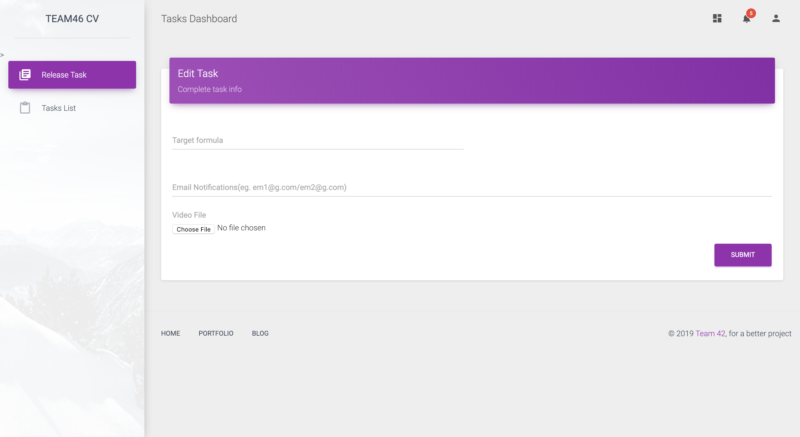

# 2019PWC_CV_Challenge
A repository about 2019 PWC Competition, in Challenge 1: Computer vision challenge.

For time reason, this repository only has interface and notification tools.

# Interface(Web pages)

In there, we hope the website can help to release tasks more easily(The website is still working).

# Tools

### Notification

SMTP for email notification, if you want to use enterprise email address, we can change it to alicloud implemention.

Details in 2019PWC_CV_Challenge/pwc2019/mail_notification.py

### CSV Converter

Convert txt file to csv file.

Details in 2019PWC_CV_Challenge/pwc2019/file_converter.py